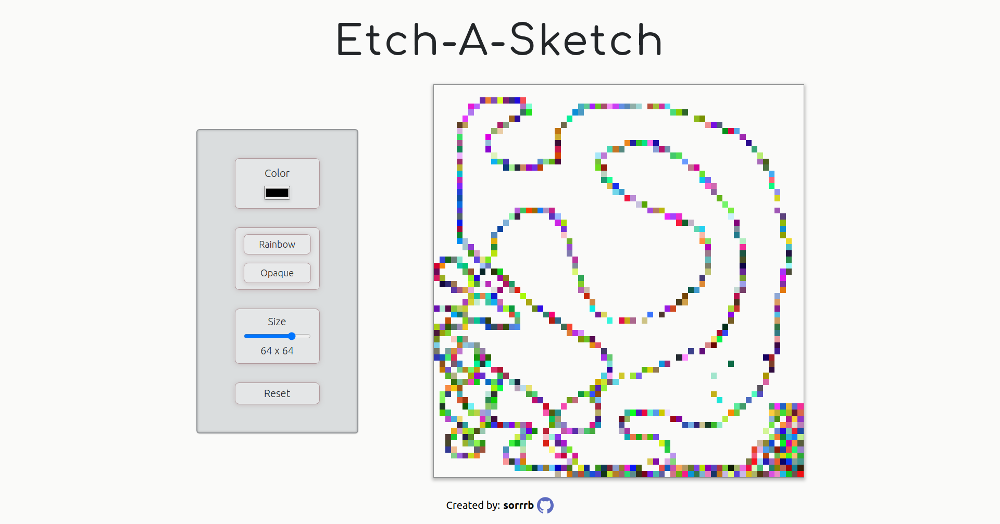

# etch-a-sketch
A webpage implementation of the classic mechanical toy "Etch-A-Sketch" 

[Live Demo](https://sorrrb.github.io/etch-a-sketch/)

## Demo Preview

### Changelog
6/20/2022 13:00 - initialize repository 
6/20/2022 16:04 - complete basic cursor trail logic to change background color 
6/20/2022 19:30 - complete initial deployment with basic functionality 
6/20/2022 20:30 - improve visual design of initial deployment 
6/21/2022 20:10 - complete second iteration of project with improved visual design/functionality 

### Languages
- HTML
- CSS
- JavaScript (vanilla - ES6)

### Concepts
- CSS Grid
- Node properties/methods
- Nodelists & Grouping nodes
- Event Listeners
- Event Capture/Bubbling & Propogation
- JavaScript console debugging
- Git & Command Line proficiency

## Attribution(s)
[Pixel perfect](https://www.flaticon.com/authors/pixel-perfect) (https://icon54.com) - GitHub SVG icon usage in footer

#### To-Do
N/A