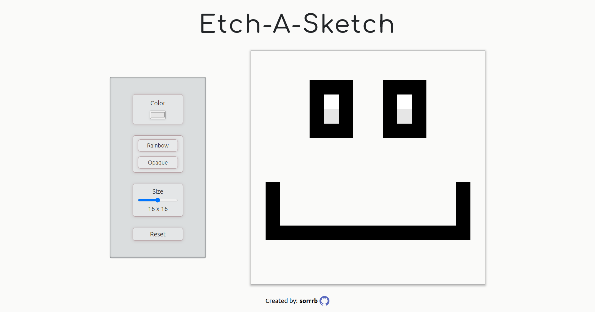

# etch-a-sketch
A webpage implementation of the classic mechanical toy "Etch-A-Sketch"

## Demo Preview

### Changelog
6/20/2022 13:00 - initialize repository 
6/20/2022 16:04 - complete basic cursor trail logic to change background color 
6/20/2022 19:30 - complete initial deployment with basic functionality 
6/20/2022 20:30 - improve visual design of initial deployment 

### Languages
- HTML
- CSS
- JavaScript (vanilla - ES6)

### Concepts
- CSS Grid
- Node properties/methods
- Nodelists & Grouping nodes
- Event Listeners
- Event Capture/Bubbling & Propogation
- JavaScript console debugging

## Attribution(s)
N/A

#### To-Do
- Add footer
- Add button to change color mode
- Improve general page layout